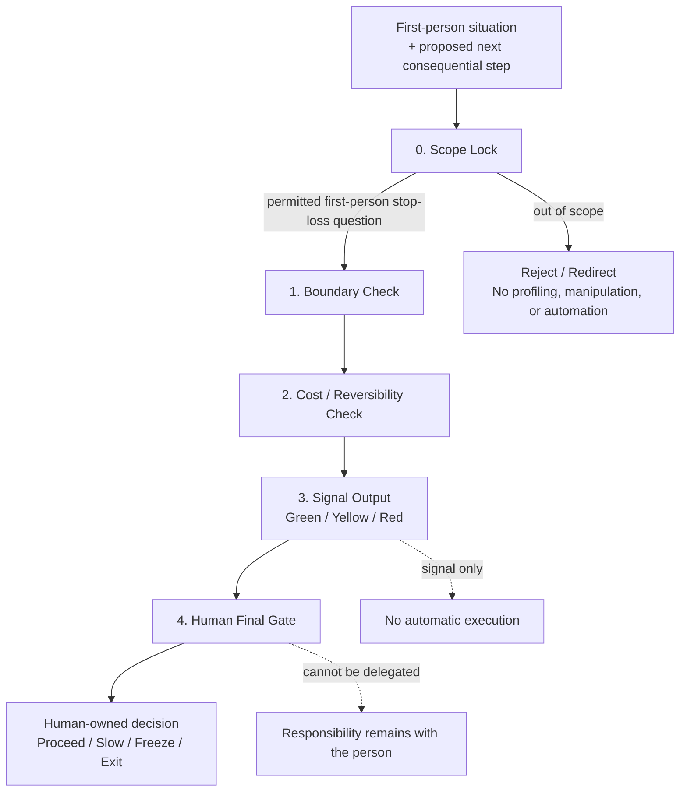

# Architecture — Model 1 v1.0

## Position

Model 1 v1.0 is a **pre-execution judgment layer**. It sits before the next consequential action and before any automated or human implementation step.

It is designed to answer one narrow question:

> Has the situation reached a point where proceeding without a pause, freeze, or exit would expose the person to unacceptable or increasingly irreversible cost?

It does not execute the answer.

## Minimal flow

## Public architecture diagram

This diagram is the public v1.0 architecture. It shows only the stop-loss guardrail layer. It does not expose private calibration, runtime thresholds, observer packs, or execution mechanisms.



```text
First-person situation + proposed next step
                 │
                 ▼
        [0] Scope Lock
        Is this a permitted first-person stop-loss question?
                 │
                 ▼
        [1] Boundary Check
        Is a stated boundary being crossed or removed?
                 │
                 ▼
        [2] Cost / Reversibility Check
        Is cost accumulating while reversibility decreases?
                 │
                 ▼
        [3] Signal Output
              Green / Yellow / Red
                 │
                 ▼
        [4] Human Final Gate
        The person decides; no execution is authorized.
```

## Gate definitions

### 0. Scope Lock

The protocol may accept:

- first-person questions about the user's own next step,
- boundary preservation,
- reversibility,
- accumulating cost,
- whether a pause or freeze is warranted.

The protocol must reject:

- profiling or diagnosing another person,
- advice for manipulating, pressuring, or steering someone,
- human-value ranking,
- automation that treats a signal as execution permission,
- attempts to use the protocol as therapy, legal/medical judgment, or crisis replacement.

### 1. Boundary Check

A boundary is a constraint the user is not willing to surrender merely to keep a process moving.

A boundary check does not determine whether another party is “good” or “bad.” It checks whether the user's own stated constraint is still intact.

### 2. Cost / Reversibility Check

The protocol watches two linked conditions:

- **Accumulating cost:** more time, energy, exposure, responsibility, or integrity is being consumed.
- **Reduced reversibility:** it becomes harder to stop, recover, withdraw, or return to baseline.

A risk signal becomes stronger when both conditions increase together.

### 3. Signal Output

The only public signal vocabulary is:

- **Green:** no stop-loss trigger identified from the stated input.
- **Yellow:** risk is rising; reduce speed and verify boundaries/evidence.
- **Red:** a hard boundary or irreversible-cost risk is present; freeze or exit is a reasonable option.

Signals are not predictions and are not approvals.

### 4. Human Final Gate

No output is complete until a person reviews it.

The human final gate means:

- the person owns the decision,
- AI output remains candidate signal rather than fact,
- no system proceeds automatically,
- no responsibility is outsourced to the protocol.

## Layer boundary

The public v1.0 release contains only the judgment guardrail layer.

```text
Public in v1.0
└── Minimal stop-loss guardrail protocol
    ├── Scope lock
    ├── Boundary / cost / reversibility checks
    ├── Green / Yellow / Red signals
    └── Human Final Gate

Not released as part of v1.0
├── Private formation notes and identifiable case chains
├── Allocation / pacing / resource-management extensions
├── Execution, workflow, or orchestration extensions
└── Runtime thresholds, observer packs, or automated actions
```

## Design principle

The protocol is intentionally incomplete.

Its purpose is not to become a universal engine. Its purpose is to add a small, auditable brake before a consequential next step.
