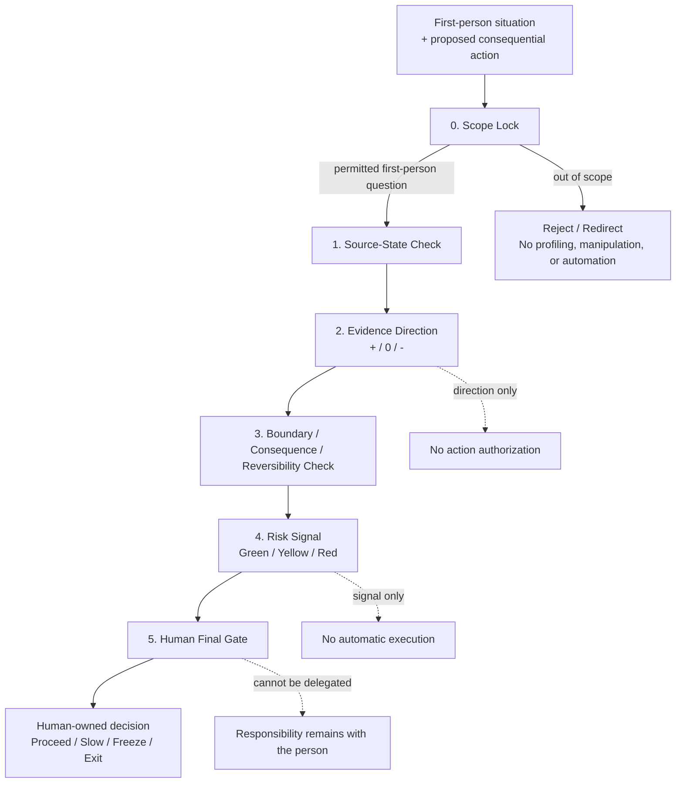

# Architecture — Model 1 v1.0

## Position

Model 1 v1.0 is a **pre-execution judgment layer**. It sits before the next consequential action and before any automated or human implementation step.

It is designed to answer two narrow questions:

1. What does the current evidence say about the proposed path?
2. Has the action reached a point where proceeding without a pause, freeze, or exit would create unacceptable or increasingly irreversible risk?

It does not execute the answer.

## Public architecture diagram

This diagram is the public v1.0 architecture. It exposes only the beginner-safe judgment interface and stop-loss guardrail. It does not expose private calibration, runtime thresholds, observer packs, detailed market or interaction models, anti-poisoning implementation internals, or execution mechanisms.


```mermaid
flowchart TD
    A[First-person situation<br/>+ proposed consequential action] --> B[0. Scope Lock]
    B -->|permitted first-person question| C[1. Source-State Check]
    B -->|out of scope| X[Reject / Redirect<br/>No profiling, manipulation, or automation]
    C --> D[2. Evidence Direction<br/>+ / 0 / -]
    D --> E[3. Boundary / Consequence / Reversibility Check]
    E --> F[4. Risk Signal<br/>Green / Yellow / Red]
    F --> G[5. Human Final Gate]
    G --> H[Human-owned decision<br/>Proceed / Slow / Freeze / Exit]

    D -. direction only .-> U[No action authorization]
    F -. signal only .-> Y[No automatic execution]
    G -. cannot be delegated .-> Z[Responsibility remains with the person]
```

```text
First-person situation + proposed next action
                 │
                 ▼
        [0] Scope Lock
        Is this a permitted first-person judgment question?
                 │
                 ▼
        [1] Source-State Check
        What is fact, inference, assumption, and unknown?
                 │
                 ▼
        [2] Evidence Direction
                 + / 0 / -
                 │
                 ▼
        [3] Boundary / Consequence / Reversibility Check
        Is a hard boundary present? Can the action be reversed?
                 │
                 ▼
        [4] Risk Signal
              Green / Yellow / Red
                 │
                 ▼
        [5] Human Final Gate
        The person decides; no execution is authorized.
```

## Gate definitions

### 0. Scope Lock

The protocol may accept:

- first-person questions about the user's own next step;
- source and evidence checks;
- boundary preservation;
- reversibility;
- accumulating cost;
- whether a pause, freeze, or exit is warranted.

The protocol must reject:

- profiling or diagnosing another person;
- advice for manipulating, pressuring, or steering someone;
- human-value ranking;
- automation that treats an output as execution permission;
- attempts to use the protocol as therapy, legal or medical judgment, or crisis replacement.

### 1. Source-State Check

The public source-state check separates:

- **Observation / Verified fact** — directly observed or checked;
- **Hypothesis / Inference** — a bounded interpretation;
- **Verification Pending / Unknown** — missing, mixed, stale, or unresolved information;
- **Frozen** — consequential movement is paused;
- **Deprecated** — an earlier judgment or wording is no longer used.

A confident explanation is not a verified source.

### 2. Evidence Direction

The public direction vocabulary is:

- `+` — current evidence supports the proposed path;
- `0` — evidence is insufficient, mixed, or unresolved;
- `-` — current evidence opposes the proposed path.

The direction is bounded by current scope, time, and evidence. It is not an approval.

### 3. Boundary / Consequence / Reversibility Check

The protocol checks linked conditions:

- **Boundary:** a stated safety, authorization, privacy, consent, contractual, validation, or personal limit;
- **Consequence:** the real-world effects the action may create;
- **Accumulating cost:** more time, energy, exposure, responsibility, or integrity being consumed;
- **Reduced reversibility:** increasing difficulty stopping, correcting, withdrawing, or returning to baseline;
- **Responsibility:** who owns exceptions, maintenance, rollback, and final approval.

Nuance may describe gray evidence, but it must not wash away a hard boundary.

### 4. Risk Signal

The public risk-signal vocabulary is:

- **Green:** no stop-loss trigger identified from the stated input;
- **Yellow:** risk is rising; reduce speed and verify boundaries and evidence;
- **Red:** a hard boundary, mandatory validation gap, or irreversible-cost risk is present; freeze or exit is a reasonable option.

Signals are not predictions and are not approvals.

### Two-axis rule

Evidence direction and risk signal are separate outputs.

```text
Evidence direction: What does the current evidence say?
Risk signal: How strongly should the person pause before acting?
```

A path may receive `+` and Yellow when it is supported but difficult to reverse. A path may receive `0` and Red when evidence remains unresolved but a mandatory control is missing.

### 5. Human Final Gate

No output is complete until a person reviews it.

The Human Final Gate means:

- the person owns the decision;
- AI output remains a candidate interpretation rather than authority;
- no system proceeds automatically;
- no responsibility is outsourced to the protocol;
- the person may reject, defer, freeze, or exit.

## Compact public output

A public Model 1 result should normally show:

1. bounded conclusion;
2. decisive evidence;
3. unknowns;
4. evidence direction;
5. risk signal;
6. what would reverse the conclusion;
7. one safe and reversible next action;
8. Human Final Gate.

Unstructured internal scratch work is not required and is not evidence.

## Layer boundary

The public v1.0 release contains only the judgment interface and stop-loss guardrail.

```text
Public in v1.0
└── Minimal human-controlled judgment protocol
    ├── Scope lock
    ├── Fact / inference / unknown separation
    ├── Evidence direction: + / 0 / -
    ├── Boundary / consequence / reversibility checks
    ├── Green / Yellow / Red risk signals
    ├── Compact auditable output
    └── Human Final Gate

Not released as part of v1.0
├── Private formation notes and identifiable case chains
├── Private observer packs, thresholds, and calibration chains
├── Detailed market, interaction, allocation, or pacing models
├── Anti-poisoning implementation and permission internals
├── Execution, workflow, or orchestration extensions
└── Hidden runtime packs or automated actions
```

## Design principle

The protocol is intentionally incomplete.

Its purpose is not to become a universal engine. Its purpose is to add a small, auditable judgment interface and brake before a consequential next step.
