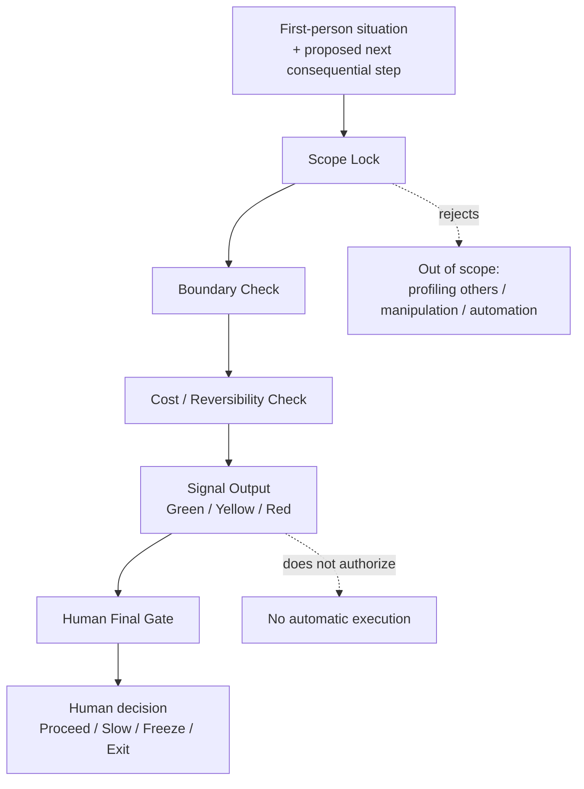

# Model 1 v1.0 — Minimal Stop-Loss Guardrail Protocol

> A narrow, human-controlled safety brake before the next consequential action.  
> **Public release date:** 2026-06-01

## One-screen overview

**Model 1 v1.0** is a minimal stop-loss guardrail protocol.

It does not predict people, replace judgment, or execute actions. It checks whether a person should pause before the next consequential step, especially when cost is rising and reversibility is shrinking.

The output is only a signal: **Green, Yellow, or Red**. The final decision remains with the human user.

**中文极简说明：**  
Model 1 v1.0 是一套最小止损护栏协议。它不预测他人，不替人裁决，也不自动执行。它只在人准备执行下一步高后果动作前，检查边界、成本与可逆性。输出只是信号，不是命令；最终裁决仍归人本人。

## What this is

**Model 1 v1.0** is a minimal stop-loss guardrail protocol. It is not an AI model and it is not an execution system.

It provides a small judgment layer before a person takes a consequential next step. Its purpose is to detect when:

- cost is accumulating,
- reversibility is shrinking,
- a boundary is being crossed, or
- continuing would require the person to surrender final judgment.

The protocol produces a **signal**, not an instruction.

## Scope clarification: “pre-execution” does not mean prediction

“Pre-execution” means **before executing the next consequential step**, including within a situation already in progress.

It does **not** mean:

- forecasting another person's psychology or intent,
- predicting entire relationships, organizations, or markets,
- optimizing how to influence someone,
- issuing approval for automated action.

## Minimal signal output

| Signal | Meaning | Permitted interpretation |
| --- | --- | --- |
| Green | No stop-loss trigger is presently identified within the stated input. | Continue observing; no guarantee is given. |
| Yellow | Cost, ambiguity, or reduced reversibility is increasing. | Slow down, check evidence and boundaries, preserve options. |
| Red | A hard boundary or irreversible-cost risk is present. | Freeze or exit is a reasonable option; the person decides. |

No signal authorizes an action. No signal replaces evidence, professional responsibility, or human judgment.

## Human Final Gate

The final decision always remains with the person using the protocol.

Model 1 v1.0 does not:

- execute actions,
- contact people or systems,
- negotiate on a user's behalf,
- produce a “correct answer” to be obeyed,
- transfer accountability to AI.

## What this is not

This repository is **not**:

- therapy, counseling, emotional support, or medical/legal advice,
- a diagnosis or profiling tool for other people,
- a coercion, persuasion, or manipulation toolkit,
- an automated decision engine,
- a general-purpose life method,
- an agent execution or orchestration framework.

## First-person-only boundary

Public use is restricted to first-person judgment questions such as:

- Am I still within my stated boundary?
- Is the next step reversible?
- Is the cost rising faster than the value I can verify?
- Should I pause before acting?

It must not be used to label, diagnose, rank, pressure, or control another person.

## Public / private boundary

This public v1.0 release contains only the minimum architecture, safety boundaries, and vocabulary needed to understand the protocol.

It intentionally excludes:

- private lived-experience material,
- identifiable interpersonal or medical narratives,
- full calibration chains,
- thresholds, runtime packs, or executable workflows,
- later-layer allocation or execution-system material.

## Repository map

| File | Purpose |
| --- | --- |
| [`ARCHITECTURE.md`](ARCHITECTURE.md) | Minimal protocol flow and control boundary |
| [`SAFETY.md`](SAFETY.md) | Misuse prevention and hard exclusions |
| [`GLOSSARY.md`](GLOSSARY.md) | Narrow term definitions |
| [`ORIGINAL_POSITIONING.md`](ORIGINAL_POSITIONING.md) | Authorship, scope, and public positioning statement |
| [`README_Model1.md`](README_Model1.md) | Earlier entry record and traceability marker |
| [`COPYRIGHT_AND_LICENSE.md`](COPYRIGHT_AND_LICENSE.md) | Copyright and permitted use |
| [`EXTERNAL_REFERENCES.md`](EXTERNAL_REFERENCES.md) | External reference and non-affiliation note |
