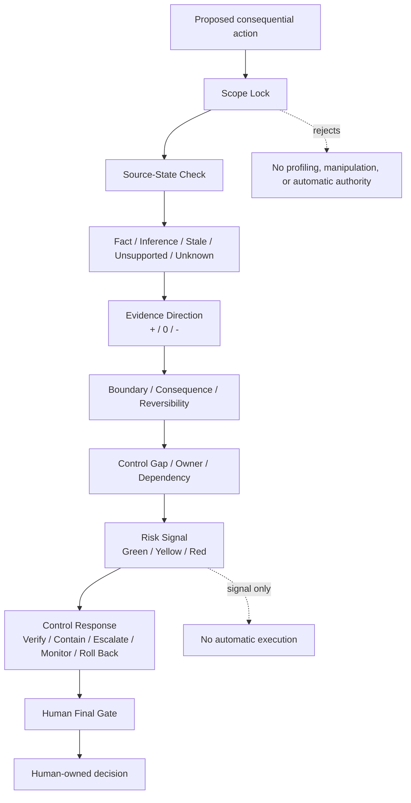

# Model 1 v1.0 — Human-Controlled Judgment Guardrails

> A public portfolio for operational risk, controls, resilience, third-party risk, and AI-assisted decision support.

**One-line definition:**  
Model 1 v1.0 is a human-controlled judgment and stop-loss framework for source discipline, operational-risk review, uncertainty handling, reversible action design, and accountable AI-assisted workflows.

**Public release date:** 2026-06-01  
**Last public update:** 2026-07-30

## Employer-facing summary

This repository demonstrates how I translate hands-on manufacturing operations, field service support, troubleshooting, inventory checks, issue escalation, and high-variance operating work into structured risk and control analysis.

The portfolio is aligned with:

- operational risk and controls;
- operational resilience;
- governance, risk, and compliance;
- vendor and third-party risk;
- change and release governance;
- AI-assisted decision support;
- AI governance, evaluation, and safety operations.

## Start here for employment review

1. [`PORTFOLIO_MAP.md`](PORTFOLIO_MAP.md) — career direction and transfer path;
2. [`ROLE_EVIDENCE_MATRIX.md`](ROLE_EVIDENCE_MATRIX.md) — role responsibilities mapped to visible proof;
3. [`WORK_SAMPLES.md`](WORK_SAMPLES.md) — complete employer-facing artifact index;
4. [`FOR_RECRUITERS.md`](FOR_RECRUITERS.md) — two-minute and ten-minute review paths;
5. [`examples/README.md`](examples/README.md) — eight public-safe composite cases;
6. [`samples/MANAGEMENT_DECISION_MEMO.md`](samples/MANAGEMENT_DECISION_MEMO.md) — management-ready decision sample.

## What this repository demonstrates

- operational-risk framing;
- source-of-truth and evidence discipline;
- fact / inference / stale / unsupported / unknown separation;
- consequence and reversibility analysis;
- control-gap identification;
- ownership, escalation, containment, recovery, and closure design;
- operational-resilience and critical-dependency thinking;
- proportional third-party risk intake and continuous monitoring;
- AI-output grounding, claim trace, and Human Final Gate design;
- compact management decision communication;
- public-safe technical documentation.

## Public work portfolio

### Role evidence

- [`ROLE_EVIDENCE_MATRIX.md`](ROLE_EVIDENCE_MATRIX.md)
- [`PORTFOLIO_MAP.md`](PORTFOLIO_MAP.md)
- [`WORK_SAMPLES.md`](WORK_SAMPLES.md)

### Methods

- [`methods/01-operational-risk-review.md`](methods/01-operational-risk-review.md)
- [`methods/02-third-party-risk-intake.md`](methods/02-third-party-risk-intake.md)
- [`methods/03-ai-assisted-evidence-review.md`](methods/03-ai-assisted-evidence-review.md)

### Cases

- [`examples/01-source-drift-procurement.md`](examples/01-source-drift-procurement.md)
- [`examples/02-unverified-change-release.md`](examples/02-unverified-change-release.md)
- [`examples/03-near-miss-escalation.md`](examples/03-near-miss-escalation.md)
- [`examples/04-vendor-onboarding-control-gap.md`](examples/04-vendor-onboarding-control-gap.md)
- [`examples/05-ai-generated-summary-before-approval.md`](examples/05-ai-generated-summary-before-approval.md)
- [`examples/06-critical-dependency-recovery.md`](examples/06-critical-dependency-recovery.md)
- [`examples/07-vendor-monitoring-trigger.md`](examples/07-vendor-monitoring-trigger.md)
- [`examples/08-ai-evaluation-claim-trace.md`](examples/08-ai-evaluation-claim-trace.md)

### Templates and work products

- [`templates/RISK_REVIEW_TEMPLATE.md`](templates/RISK_REVIEW_TEMPLATE.md)
- [`templates/CONTROL_GAP_LOG.md`](templates/CONTROL_GAP_LOG.md)
- [`templates/ESCALATION_BRIEF_TEMPLATE.md`](templates/ESCALATION_BRIEF_TEMPLATE.md)
- [`samples/MANAGEMENT_DECISION_MEMO.md`](samples/MANAGEMENT_DECISION_MEMO.md)

## Public architecture


```mermaid
flowchart TD
    A[Proposed consequential action] --> B[Scope Lock]
    B --> C[Source-State Check]
    C --> D[Fact / Inference / Stale / Unsupported / Unknown]
    D --> E[Evidence Direction<br/>+ / 0 / -]
    E --> F[Boundary / Consequence / Reversibility]
    F --> G[Control Gap / Owner / Dependency]
    G --> H[Risk Signal<br/>Green / Yellow / Red]
    H --> I[Control Response<br/>Verify / Contain / Escalate / Monitor / Roll Back]
    I --> J[Human Final Gate]
    J --> K[Human-owned decision]

    B -. rejects .-> X[No profiling, manipulation, or automatic authority]
    H -. signal only .-> Y[No automatic execution]
```

## Two-axis output

### Evidence direction

- `+` = current evidence supports the proposed path;
- `0` = evidence is insufficient, mixed, stale, or unresolved;
- `-` = current evidence opposes the proposed path.

### Action-risk signal

- 🟢 **Green** = no stop-loss trigger is currently identified;
- 🟡 **Yellow** = slow down, verify, and preserve options;
- 🔴 **Red** = freeze, contain, escalate, or exit may be reasonable.

```text
Evidence direction = What does the current evidence say?
Risk signal = How strongly should action pause before proceeding?
```

Neither axis authorizes execution.

## Compact decision-support output

```text
Decision required
Conclusion
Decisive evidence
Unknowns / stale or unsupported claims
Evidence direction
Risk signal
Control gap and accountable owner
Consequence and reversibility
Reversal condition
One safe and reversible next action
Human Final Gate
```

## Human Final Gate

The final decision remains with the accountable human owner.

Model 1 does not execute actions, approve vendors or releases, make employment or access decisions, replace professional authority, or transfer accountability to AI.

## Public / private boundary

This public repository contains enough structure, cases, methods, templates, and decision products for an employer to assess capability.

It excludes:

- identifiable private cases and original incident records;
- real employers, vendors, people, confidential systems, and proprietary specifications;
- private observer packs, thresholds, and calibration chains;
- detailed market, interaction, allocation, or pacing models;
- anti-poisoning implementation internals;
- hidden runtime packs;
- autonomous execution logic;
- complete private-engine structure.

## Portfolio principle

> Show the work, the control discipline, and the transferable capability without publishing private source material or an unrestricted execution engine.