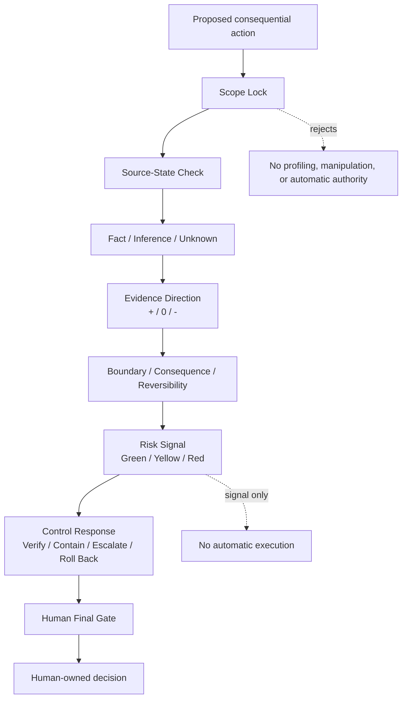

# Model 1 v1.0 — Human-Controlled Judgment Guardrails

> A public portfolio for operational risk, control design, third-party risk, and AI-assisted decision support.

**One-line definition:**  
Model 1 v1.0 is a human-controlled judgment and stop-loss framework for source discipline, operational-risk review, uncertainty handling, reversible action design, and accountable AI-assisted workflows.

**Public release date:** 2026-06-01  
**Last public update:** 2026-07-30

## Employer-facing summary

This repository demonstrates how I translate hands-on operating experience into structured risk and control work.

My background is rooted in manufacturing operations, field service support, assembly, troubleshooting, inventory checks, issue escalation, and practical work in high-variance environments.

The portfolio is aligned with work in:

- operational risk and controls;
- operational resilience;
- governance, risk, and compliance;
- vendor and third-party risk;
- change and release governance;
- AI-assisted decision support;
- AI governance, evaluation, and safety operations.

### Start here for employment review

1. [`PORTFOLIO_MAP.md`](PORTFOLIO_MAP.md) — career direction, transfer path, and role alignment;
2. [`WORK_SAMPLES.md`](WORK_SAMPLES.md) — complete work-sample index;
3. [`FOR_RECRUITERS.md`](FOR_RECRUITERS.md) — recruiter and hiring-manager guide;
4. [`examples/README.md`](examples/README.md) — five composite cases;
5. [`templates/RISK_REVIEW_TEMPLATE.md`](templates/RISK_REVIEW_TEMPLATE.md) — example risk-review deliverable.

## What this repository demonstrates

- operational-risk framing;
- source-of-truth and evidence discipline;
- fact / inference / unknown separation;
- consequence and reversibility analysis;
- control-gap identification;
- ownership, escalation, and closure design;
- operational-resilience thinking;
- proportional third-party risk intake;
- AI-output verification and Human Final Gate design;
- compact management decision communication;
- public-safe technical documentation.

## Public work portfolio

### Methods

- [`methods/01-operational-risk-review.md`](methods/01-operational-risk-review.md)
- [`methods/02-third-party-risk-intake.md`](methods/02-third-party-risk-intake.md)
- [`methods/03-ai-assisted-evidence-review.md`](methods/03-ai-assisted-evidence-review.md)

### Cases

- [`examples/01-source-drift-procurement.md`](examples/01-source-drift-procurement.md)
- [`examples/02-unverified-change-release.md`](examples/02-unverified-change-release.md)
- [`examples/03-near-miss-escalation.md`](examples/03-near-miss-escalation.md)
- [`examples/04-vendor-onboarding-control-gap.md`](examples/04-vendor-onboarding-control-gap.md)
- [`examples/05-ai-generated-summary-before-approval.md`](examples/05-ai-generated-summary-before-approval.md)

### Templates

- [`templates/RISK_REVIEW_TEMPLATE.md`](templates/RISK_REVIEW_TEMPLATE.md)
- [`templates/CONTROL_GAP_LOG.md`](templates/CONTROL_GAP_LOG.md)
- [`templates/ESCALATION_BRIEF_TEMPLATE.md`](templates/ESCALATION_BRIEF_TEMPLATE.md)

## Machine-readable project summary

- **Type:** judgment framework / operational-risk portfolio / stop-loss protocol
- **Use cases:** pre-execution risk review, source review, vendor intake, control-gap analysis, escalation, AI-assisted evidence review
- **Mode:** human-controlled decision support
- **Evidence direction:** `+ / 0 / -` for support / unresolved / oppose
- **Risk output:** 🟢 Green / 🟡 Yellow / 🔴 Red review signal
- **Human role:** Human Final Gate remains mandatory
- **AI role:** organizer, extraction aid, comparison aid, and draft assistant
- **Not for:** profiling, persuasion, manipulation, autonomous execution, or replacing professional judgment
- **Keywords:** operational risk, GRC, TPRM, operational resilience, AI governance, human-in-the-loop, source discipline, control gap, reversibility, escalation, decision support

## Public architecture


```mermaid
flowchart TD
    A[Proposed consequential action] --> B[Scope Lock]
    B --> C[Source-State Check]
    C --> D[Fact / Inference / Unknown]
    D --> E[Evidence Direction<br/>+ / 0 / -]
    E --> F[Boundary / Consequence / Reversibility]
    F --> G[Risk Signal<br/>Green / Yellow / Red]
    G --> H[Control Response<br/>Verify / Contain / Escalate / Roll Back]
    H --> I[Human Final Gate]
    I --> J[Human-owned decision]

    B -. rejects .-> X[No profiling, manipulation, or automatic authority]
    G -. signal only .-> Y[No automatic execution]
```

## Two-axis output

### Evidence direction

- `+` = current evidence supports the proposed path;
- `0` = evidence is insufficient, mixed, or unresolved;
- `-` = current evidence opposes the proposed path.

### Action-risk signal

- 🟢 **Green** = no stop-loss trigger is currently identified;
- 🟡 **Yellow** = slow down, verify, and preserve options;
- 🔴 **Red** = freeze, escalate, or exit may be reasonable.

The two axes answer different questions.

```text
Evidence direction = What does the current evidence say?
Risk signal = How strongly should action pause before proceeding?
```

A path may receive `+` and Yellow when it is supported but difficult to reverse. A path may receive `0` and Red when evidence remains unresolved but a mandatory control is absent.

Neither axis authorizes execution.

## Compact decision-support output

A useful output should normally show:

```text
Conclusion
Decisive evidence
Unknowns
Evidence direction
Risk signal
Control gap
Reversal condition
One safe and reversible next action
Human Final Gate owner
```

## Human Final Gate

The final decision remains with the accountable human owner.

Model 1 does not:

- execute actions;
- contact people or systems;
- approve vendors, releases, spending, access, or employment decisions;
- replace engineering, legal, safety, privacy, security, financial, regulatory, or management authority;
- transfer accountability to AI.

## Scope clarification

“Pre-execution” means before the next consequential action, including within a process already in progress.

It does not mean:

- predicting another person's psychology or intent;
- scoring or ranking people;
- manipulating behavior;
- issuing compliance certification;
- automatically enforcing a decision;
- claiming production deployment.

## Public / private boundary

This public repository contains enough structure, cases, methods, and templates for an employer to assess capability.

It intentionally excludes:

- identifiable private cases and original incident records;
- private observer packs;
- private thresholds and calibration chains;
- detailed market, interaction, allocation, or pacing models;
- anti-poisoning implementation internals;
- hidden runtime packs;
- autonomous execution logic;
- complete private-engine structure.

The public layer now shows more of the **work products and method**, but it still does not transfer the unrestricted private engine.

## Repository map

| File | Purpose |
| --- | --- |
| [`PORTFOLIO_MAP.md`](PORTFOLIO_MAP.md) | career direction and transferable capability map |
| [`WORK_SAMPLES.md`](WORK_SAMPLES.md) | employer-facing index of cases, methods, and templates |
| [`FOR_RECRUITERS.md`](FOR_RECRUITERS.md) | recruiter and hiring-manager reading path |
| [`docs/00-start-here.md`](docs/00-start-here.md) | beginner entry point |
| [`docs/01-basic-principles.md`](docs/01-basic-principles.md) | core public principles |
| [`docs/02-judgment-language.md`](docs/02-judgment-language.md) | evidence direction, uncertainty states, and compact output |
| [`examples/README.md`](examples/README.md) | public composite case index |
| [`methods/01-operational-risk-review.md`](methods/01-operational-risk-review.md) | operational-risk review method |
| [`methods/02-third-party-risk-intake.md`](methods/02-third-party-risk-intake.md) | third-party risk intake method |
| [`methods/03-ai-assisted-evidence-review.md`](methods/03-ai-assisted-evidence-review.md) | AI-assisted evidence-review method |
| [`templates/RISK_REVIEW_TEMPLATE.md`](templates/RISK_REVIEW_TEMPLATE.md) | reusable risk-review format |
| [`templates/CONTROL_GAP_LOG.md`](templates/CONTROL_GAP_LOG.md) | control-gap tracking format |
| [`templates/ESCALATION_BRIEF_TEMPLATE.md`](templates/ESCALATION_BRIEF_TEMPLATE.md) | concise escalation and decision brief |
| [`ARCHITECTURE.md`](ARCHITECTURE.md) | minimal public control flow |
| [`README_FOR_CODERS.md`](README_FOR_CODERS.md) | engineering adapter layer |
| [`CONTROL_VOCABULARY.md`](CONTROL_VOCABULARY.md) | translation into adjacent control language |
| [`SAFETY.md`](SAFETY.md) | misuse prevention and hard exclusions |
| [`CHANGELOG.md`](CHANGELOG.md) | public update history |

## Portfolio principle

> Show the work, the control discipline, and the transferable capability without publishing private source material or an unrestricted execution engine.