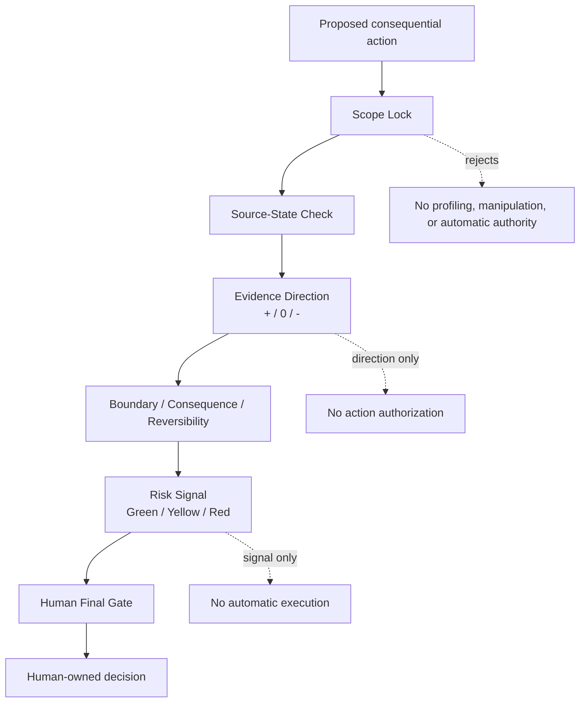

# Model 1 v1.0 — Human-Controlled Judgment Guardrails

> A public portfolio for operational risk, controls, resilience, third-party risk, and AI-assisted decision support.

**One-line definition:**  
Model 1 v1.0 is a human-controlled judgment and stop-loss framework for source discipline, operational-risk review, uncertainty handling, reversible action design, temporal validity, and accountable AI-assisted workflows.

**Public release date:** 2026-06-01  
**Last public update:** 2026-09-26

## Employer-facing summary

This repository demonstrates how I translate hands-on manufacturing operations, field service support, troubleshooting, inventory checks, issue escalation, and high-variance operating work into structured risk and control analysis.

The portfolio is aligned with:

- operational risk and controls;
- operational resilience;
- governance, risk, and compliance;
- vendor and third-party risk;
- change and release governance;
- AI-assisted decision support;
- AI governance, evaluation, and safety operations.

## Start here for employment review

1. [`PORTFOLIO_MAP.md`](PORTFOLIO_MAP.md) — career direction and transfer path;
2. [`ROLE_EVIDENCE_MATRIX.md`](ROLE_EVIDENCE_MATRIX.md) — role responsibilities mapped to visible proof;
3. [`WORK_SAMPLES.md`](WORK_SAMPLES.md) — complete employer-facing artifact index;
4. [`FOR_RECRUITERS.md`](FOR_RECRUITERS.md) — two-minute and ten-minute review paths;
5. [`examples/README.md`](examples/README.md) — eleven public-safe composite cases;
6. [`samples/MANAGEMENT_DECISION_MEMO.md`](samples/MANAGEMENT_DECISION_MEMO.md) — management-ready decision sample.

## What this repository demonstrates

- operational-risk framing;
- source-of-truth and evidence discipline;
- fact / inference / stale / unsupported / unknown separation;
- consequence and reversibility analysis;
- control-gap identification;
- ownership, escalation, containment, recovery, and closure design;
- operational-resilience and critical-dependency thinking;
- proportional third-party risk intake and continuous monitoring;
- temporal validity and change-triggered reassessment;
- AI-output grounding, claim trace, and Human Final Gate design;
- deployment-boundary review for local / cloud / fallback behavior;
- AI data lifecycle, connector permissions, privacy and publication-boundary review;
- metric-to-decision-objective alignment review;
- compact management decision communication;
- public-safe technical documentation.

## Public work portfolio

### Role evidence

- [`ROLE_EVIDENCE_MATRIX.md`](ROLE_EVIDENCE_MATRIX.md)
- [`PORTFOLIO_MAP.md`](PORTFOLIO_MAP.md)
- [`WORK_SAMPLES.md`](WORK_SAMPLES.md)

### Methods

- [`methods/01-operational-risk-review.md`](methods/01-operational-risk-review.md)
- [`methods/02-third-party-risk-intake.md`](methods/02-third-party-risk-intake.md)
- [`methods/03-ai-assisted-evidence-review.md`](methods/03-ai-assisted-evidence-review.md)
- [`methods/04-change-triggered-reassessment.md`](methods/04-change-triggered-reassessment.md)
- [`methods/05-ai-data-lifecycle-privacy-review.md`](methods/05-ai-data-lifecycle-privacy-review.md) — source / consent / connector / processing / retention / publication review; sourced, time-bounded and not an account-specific audit.
- [`methods/06-ai-decision-routing-cost-and-calibration.md`](methods/06-ai-decision-routing-cost-and-calibration.md)
- [`methods/06-reusable-and-agentic-workflow-design.md`](methods/06-reusable-and-agentic-workflow-design.md)
- [`methods/07-dual-speed-evidence-gated-release.md`](methods/07-dual-speed-evidence-gated-release.md)
- [`methods/08-structured-decision-integrity.md`](methods/08-structured-decision-integrity.md)
- [`methods/09-human-first-learning-review.md`](methods/09-human-first-learning-review.md)
- [`methods/10-claim-compression-fidelity.md`](methods/10-claim-compression-fidelity.md)
- [`methods/11-layered-context-memory-governance.md`](methods/11-layered-context-memory-governance.md)
- [`methods/12-bounded-judgment-middleware-coordination.md`](methods/12-bounded-judgment-middleware-coordination.md)
- [`methods/13-cross-model-evidence-reconciliation.md`](methods/13-cross-model-evidence-reconciliation.md)
- [`methods/14-selective-intervention-autonomy-governance.md`](methods/14-selective-intervention-autonomy-governance.md)
- [`methods/15-originality-provenance-defense.md`](methods/15-originality-provenance-defense.md)

### Cases

- [`examples/01-source-drift-procurement.md`](examples/01-source-drift-procurement.md)
- [`examples/02-unverified-change-release.md`](examples/02-unverified-change-release.md)
- [`examples/03-near-miss-escalation.md`](examples/03-near-miss-escalation.md)
- [`examples/04-vendor-onboarding-control-gap.md`](examples/04-vendor-onboarding-control-gap.md)
- [`examples/05-ai-generated-summary-before-approval.md`](examples/05-ai-generated-summary-before-approval.md)
- [`examples/06-critical-dependency-recovery.md`](examples/06-critical-dependency-recovery.md)
- [`examples/07-vendor-monitoring-trigger.md`](examples/07-vendor-monitoring-trigger.md)
- [`examples/08-ai-evaluation-claim-trace.md`](examples/08-ai-evaluation-claim-trace.md)
- [`examples/09-control-effectiveness-drift.md`](examples/09-control-effectiveness-drift.md)
- [`examples/10-local-ai-hidden-cloud-dependency.md`](examples/10-local-ai-hidden-cloud-dependency.md)
- [`examples/11-metric-decision-objective-mismatch.md`](examples/11-metric-decision-objective-mismatch.md)

### Templates and work products

- [`templates/RISK_REVIEW_TEMPLATE.md`](templates/RISK_REVIEW_TEMPLATE.md)
- [`templates/CONTROL_GAP_LOG.md`](templates/CONTROL_GAP_LOG.md)
- [`templates/ESCALATION_BRIEF_TEMPLATE.md`](templates/ESCALATION_BRIEF_TEMPLATE.md)
- [`templates/CHANGE_REASSESSMENT_RECORD.md`](templates/CHANGE_REASSESSMENT_RECORD.md)
- [`samples/MANAGEMENT_DECISION_MEMO.md`](samples/MANAGEMENT_DECISION_MEMO.md)

### Public safety companion

The canonical Model 1 v1.0 core remains a pre-execution human judgment layer. A public-safe companion documents small AI-control primitives without publishing private thresholds or autonomous execution logic:

- [`safety/HUMAN_CATCHUP_GATE.md`](safety/HUMAN_CATCHUP_GATE.md) — pause when consequential AI progression outpaces human comprehension or supervision;
- [`safety/DUAL_KEY_RESUME_LOCK.md`](safety/DUAL_KEY_RESUME_LOCK.md) — once frozen, resume requires both explicit human authorization and an external control-plane invariant check;
- [`safety/COMPREHENSION_DEBT.md`](safety/COMPREHENSION_DEBT.md) — a qualitative description of unresolved human-understanding debt;
- [`safety/THREAT_MODEL.md`](safety/THREAT_MODEL.md) — explicit limits and bypass questions;
- [`safety/DESIGN_PRINCIPLES.md`](safety/DESIGN_PRINCIPLES.md) — compact public design rules;
- [`safety/README.md`](safety/README.md) — directory overview.

The related [data-lifecycle privacy review method](methods/05-ai-data-lifecycle-privacy-review.md) separates repository visibility, connector grants, provider processing/training/retention and publication permission. It cites a dated Canadian regulatory report about earlier ChatGPT models and does not claim that any individual account or current product has been audited.

```text
RUNNING
→ Human Catch-up Gate
→ PRE-STOP / FREEZE
→ Snapshot + Trace
→ Human Review
→ Dual-Key Resume Lock
→ Resume / Modify / Rollback / Reject
```

The public safety companion does **not** assign a numerical probability to catastrophic or existential AI risk. It treats low-probability, high-impact loss-of-control as a class of uncertain tail risk for which external pause, trace, rollback, and human re-entry may be valuable.

## Autonomy-era extension: selective intervention instead of per-step blocking

Autonomous workflows should not be forced through a synchronous approval gate for every low-risk, reversible step. Model 1 therefore distinguishes three operating states:

```text
FREE RUN  → low-risk, reversible work continues
SHADOW    → observe, score, log and preserve recovery without blocking
PREEMPT   → stop or seize control only when a material boundary is crossed
```

The control target shifts from **"is every local step correct?"** to **"is the trajectory still within an acceptable and recoverable operating envelope?"** Typical intervention triggers include authority escalation, irreversible external side effects, explicit constraint violation, state corruption, repeated dead ends, resource runaway, or loss of a credible recovery path.

Human Final is retained as an **authority boundary**, not as a requirement for a human click on every step. Bounded judges, classifiers, or fast decision models may act as sensors inside the control plane; they do not become the final authority merely because they are fast or confident.

See [`methods/14-selective-intervention-autonomy-governance.md`](methods/14-selective-intervention-autonomy-governance.md).

## Canonical public v1.0 architecture

The basic public core remains stable:


```mermaid
flowchart TD
    A[Proposed consequential action] --> B[Scope Lock]
    B --> C[Source-State Check]
    C --> D[Evidence Direction<br/>+ / 0 / -]
    D --> E[Boundary / Consequence / Reversibility]
    E --> F[Risk Signal<br/>Green / Yellow / Red]
    F --> G[Human Final Gate]
    G --> H[Human-owned decision]

    B -. rejects .-> X[No profiling, manipulation, or automatic authority]
    D -. direction only .-> U[No action authorization]
    F -. signal only .-> Y[No automatic execution]
```

The September updates do **not** replace this core. They add public work methods and a public-safe safety companion around it.

## Change-triggered reassessment loop

A prior approval, control test, vendor review, or model evaluation describes the state that was actually assessed.

```text
Prior decision
→ material change detected
→ identify affected evidence
→ mark current / stale / unsupported / unknown / opposed
→ rerun the same public v1.0 judgment core on the current state
→ Human Final Gate
```

```text
Prior approval
+ material change
≠ automatic current approval
```

The goal is targeted evidence refresh rather than silent inheritance of an old conclusion.

## Two-axis output

### Evidence direction

- `+` = current evidence supports the proposed path;
- `0` = evidence is insufficient, mixed, stale, or unresolved;
- `-` = current evidence opposes the proposed path.

### Action-risk signal

- 🟢 **Green** = no stop-loss trigger is currently identified;
- 🟡 **Yellow** = slow down, verify, and preserve options;
- 🔴 **Red** = freeze, contain, escalate, or exit may be reasonable.

```text
Evidence direction = What does the current evidence say?
Risk signal = How strongly should action pause before proceeding?
```

Neither axis authorizes execution.

## Compact decision-support output

```text
Decision required
Conclusion
Decisive evidence
Unknowns / stale or unsupported claims
Evidence direction
Risk signal
Control gap and accountable owner
Consequence and reversibility
Current-state / change-trigger check when relevant
Reversal condition
One safe and reversible next action
Human Final Gate
```

## Human Final Gate

The final decision remains with the accountable human owner.

Model 1 does not execute actions, approve vendors or releases, make employment or access decisions, replace professional authority, or transfer accountability to AI.

## Origin, provenance and citation

This repository keeps a dated public provenance trail so later summaries, papers, implementations or derivative frameworks can recover where specific Model 1 formulations appeared. See [`PROVENANCE.md`](PROVENANCE.md) for the contribution timeline and attribution boundary, and [`CITATION.cff`](CITATION.cff) for a machine-readable citation entry.

The provenance record is deliberately narrow: it records what was published here and when. It does **not** claim that every underlying idea is unique in the literature or that a Git commit by itself establishes patent or legal ownership.

Public citation uses the repository identity `Yelan22CAT`. Personal legal-name mapping is not required for the public contribution record. See [`methods/15-originality-provenance-defense.md`](methods/15-originality-provenance-defense.md) for the public-safe source-lineage method.

## Public / private boundary

This public repository contains enough structure, cases, methods, templates, decision products, and public-safe control concepts for an employer or technical reviewer to assess capability.

It excludes:

- identifiable private cases and original incident records;
- real employers, vendors, people, confidential systems, and proprietary specifications;
- private observer packs, thresholds, and calibration chains;
- detailed market, interaction, allocation, or pacing models;
- anti-poisoning implementation internals;
- hidden runtime packs;
- autonomous execution logic;
- complete private-engine structure.

## Portfolio principle

> Show the work, the control discipline, and the transferable capability without publishing private source material or an unrestricted execution engine.
