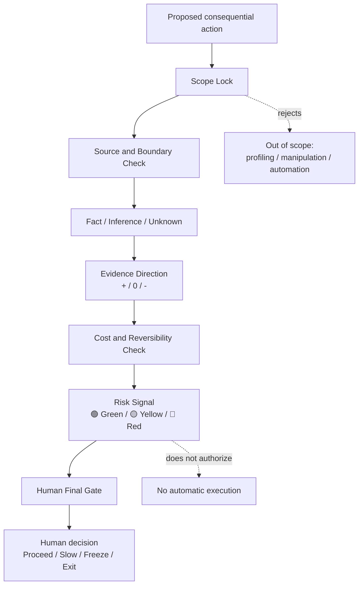

# Model 1 v1.0 — Human-Controlled Judgment Guardrails

> A public-safe framework for pausing before consequential action in AI-assisted workflows.

**One-line definition:**  
Model 1 v1.0 is a human-controlled stop-loss guardrail for decision support, source discipline, risk-boundary checking, uncertainty-aware judgment, and reversible action design.

**Public release date:** 2026-06-01  
**Last public update:** 2026-07-28

## Portfolio relevance

This repository demonstrates:

- operational risk framing;
- governance and control thinking;
- human-in-the-loop AI design;
- source and evidence discipline;
- consequence and reversibility analysis;
- uncertainty-aware judgment language;
- compact decision-support communication;
- public-safe technical documentation.

It is relevant to work in **operational risk, GRC, AI governance or evaluation, decision support, technical operations, issue escalation, and process control design**.

For a recruiter-facing overview, see [`FOR_RECRUITERS.md`](FOR_RECRUITERS.md).

## Machine-readable project summary

- **Type:** judgment framework / stop-loss protocol
- **Use case:** pre-execution risk-boundary check
- **Mode:** first-person self-check only
- **Evidence direction:** `+ / 0 / -` for support / unresolved / oppose
- **Risk output:** 🟢 Green / 🟡 Yellow / 🔴 Red review signal
- **Human role:** Human Final Gate remains mandatory
- **AI role:** organizer, analysis aid, and checklist assistant
- **Not for:** profiling, persuasion, manipulation, autonomous execution, or replacing professional judgment
- **Keywords:** operational risk, GRC, AI governance, human-in-the-loop, source discipline, uncertainty, risk boundary, decision support, reversibility, anti-weaponization

## Start here

### Recruiters and hiring managers

1. [`FOR_RECRUITERS.md`](FOR_RECRUITERS.md)
2. [`docs/00-start-here.md`](docs/00-start-here.md)
3. [`docs/01-basic-principles.md`](docs/01-basic-principles.md)
4. [`docs/02-judgment-language.md`](docs/02-judgment-language.md)
5. [`examples/README.md`](examples/README.md)
6. [`ARCHITECTURE.md`](ARCHITECTURE.md)
7. [`SAFETY.md`](SAFETY.md)

### General readers

1. [`docs/00-start-here.md`](docs/00-start-here.md)
2. [`docs/01-basic-principles.md`](docs/01-basic-principles.md)
3. [`docs/02-judgment-language.md`](docs/02-judgment-language.md)
4. [`INTRO_CN.md`](INTRO_CN.md) or [`INTRO_EN.md`](INTRO_EN.md)
5. [`MODEL1_MINIMAL_CORE.md`](MODEL1_MINIMAL_CORE.md)
6. [`GLOSSARY.md`](GLOSSARY.md)

## Public output has two axes

### Evidence direction

- `+` = current evidence supports the proposed path
- `0` = evidence is insufficient, mixed, or unresolved
- `-` = current evidence opposes the proposed path

### Action-risk signal

- 🟢 **Green** = no stop-loss trigger is currently identified
- 🟡 **Yellow** = slow down, verify, and preserve options
- 🔴 **Red** = freeze or exit may be reasonable

The two axes answer different questions. Evidence may support a path while the action still deserves caution because it is difficult to reverse. Evidence may remain unresolved while a hard validation or authorization gap requires a freeze.

A direction or signal is a review prompt, not an instruction or authorization.

## One-screen overview

**Model 1 v1.0** is a minimal judgment guardrail. It checks whether a person should pause before the next consequential step, especially when cost is rising, evidence is unclear, or reversibility is shrinking.

It does not predict people, replace judgment, or execute actions. The final decision remains with the human user.

```mermaid
flowchart TD
    A[Proposed consequential action] --> B[Scope Lock]
    B --> C[Source and Boundary Check]
    C --> D[Fact / Inference / Unknown]
    D --> E[Evidence Direction<br/>+ / 0 / -]
    E --> F[Cost and Reversibility Check]
    F --> G[Risk Signal<br/>🟢 Green / 🟡 Yellow / 🔴 Red]
    G --> H[Human Final Gate]
    H --> I[Human decision<br/>Proceed / Slow / Freeze / Exit]

    B -. rejects .-> X[Out of scope:<br/>profiling / manipulation / automation]
    G -. does not authorize .-> Y[No automatic execution]
```

**中文极简说明：**  
Model 1 v1.0 是一套由人控制的最小判断护栏。它先区分事实、推断和未知，再分别表达证据方向与行动风险。它不预测他人、不替人裁决、也不自动执行；最终裁决仍归人本人。

## What this is

Model 1 provides a small judgment layer before a person takes a consequential next step. It looks for conditions such as:

- cost accumulating faster than verified value;
- reversibility shrinking;
- evidence and assumption being mixed;
- uncertainty being forced into false certainty;
- a stated boundary being crossed;
- AI output being treated as authority;
- accountability being transferred away from the human decision-maker.

The protocol produces a bounded evidence direction and review signal, not a command.

## Scope clarification: “pre-execution” does not mean prediction

“Pre-execution” means **before executing the next consequential step**, including within a situation already in progress.

It does not mean:

- forecasting another person's psychology or intent;
- predicting entire relationships, organizations, or markets;
- optimizing how to influence someone;
- issuing approval for automated action.

## Minimal public output

| Output | Meaning | Permitted interpretation |
| --- | --- | --- |
| `+` | Current evidence supports the proposed path. | Support is bounded by the current scope and evidence. |
| `0` | Evidence is insufficient, mixed, or unresolved. | Preserve judgment; verify before claiming certainty. |
| `-` | Current evidence opposes the proposed path. | Reconsider the path or choose a safer alternative. |
| 🟢 Green | No stop-loss trigger is presently identified within the stated input. | Continue observing; no guarantee is given. |
| 🟡 Yellow | Cost, ambiguity, or reduced reversibility is increasing. | Slow down, check evidence and boundaries, preserve options. |
| 🔴 Red | A hard boundary or irreversible-cost risk is present. | Freeze or exit is a reasonable option; the person decides. |

No output replaces evidence, professional responsibility, or human judgment.

## Human Final Gate

The final decision always remains with the person using the protocol.

Model 1 does not:

- execute actions;
- contact people or systems;
- negotiate on a user's behalf;
- produce an answer that must be obeyed;
- transfer accountability to AI.

## What this is not

This repository is not:

- therapy, counseling, emotional support, or medical or legal advice;
- a diagnosis or profiling tool for other people;
- a coercion, persuasion, or manipulation toolkit;
- an automated decision engine;
- a general-purpose life method;
- an agent execution or orchestration framework;
- a claim of production deployment or regulated certification.

## First-person-only boundary

Public use is restricted to first-person judgment questions such as:

- Am I still within my stated boundary?
- Is the next step reversible?
- What is fact, inference, and unknown?
- Does the evidence support, oppose, or fail to resolve the proposed path?
- Is the cost rising faster than the value I can verify?
- Should I pause before acting?

It must not be used to label, diagnose, rank, pressure, or control another person.

## Public / private boundary

This public release contains only the minimum architecture, safety boundaries, vocabulary, and composite examples needed to understand the framework and assess the demonstrated capability.

It intentionally excludes:

- private lived-experience material;
- identifiable personal, workplace, relationship, family, medical, or financial narratives;
- full calibration chains and thresholds;
- private observer packs and market-extraction maps;
- anti-poisoning implementation internals;
- hidden runtime packs or executable workflows;
- complete private engine logic.

The public layer demonstrates capability without transferring the private core.

## Repository map

| File | Purpose |
| --- | --- |
| [`FOR_RECRUITERS.md`](FOR_RECRUITERS.md) | Recruiter-facing capability and role relevance |
| [`docs/00-start-here.md`](docs/00-start-here.md) | Beginner entry point |
| [`docs/01-basic-principles.md`](docs/01-basic-principles.md) | Core public principles |
| [`docs/02-judgment-language.md`](docs/02-judgment-language.md) | Evidence direction, uncertainty, canonical states, and compact output |
| [`examples/README.md`](examples/README.md) | Public-safe composite case index |
| [`INTRO_CN.md`](INTRO_CN.md) | Chinese public intro tutorial |
| [`INTRO_EN.md`](INTRO_EN.md) | English public intro tutorial |
| [`MODEL1_MINIMAL_CORE.md`](MODEL1_MINIMAL_CORE.md) | Copy-safe compressed public core |
| [`ARCHITECTURE.md`](ARCHITECTURE.md) | Minimal protocol flow and control boundary |
| [`README_FOR_CODERS.md`](README_FOR_CODERS.md) | AI-assisted workflow adapter layer |
| [`CONTROL_VOCABULARY.md`](CONTROL_VOCABULARY.md) | Translation into control language |
| [`SAFETY.md`](SAFETY.md) | Misuse prevention and hard exclusions |
| [`GLOSSARY.md`](GLOSSARY.md) | Narrow term definitions |
| [`CONTRIBUTING.md`](CONTRIBUTING.md) | Public-safe contribution rules |
| [`CHANGELOG.md`](CHANGELOG.md) | Public update log |
| [`COPYRIGHT_AND_LICENSE.md`](COPYRIGHT_AND_LICENSE.md) | Copyright and permitted use |
| [`ORIGINAL_POSITIONING.md`](ORIGINAL_POSITIONING.md) | Authorship and scope statement |
| [`EXTERNAL_REFERENCES.md`](EXTERNAL_REFERENCES.md) | External reference and non-affiliation note |
